# Entity Relationship Diagram — EduVora

62 tabel di PostgreSQL, diorganisir per domain. Diagram menggunakan [Mermaid](https://mermaid.js.org/) — render di GitHub/GitLab/VS Code.

---

## 1. Core — Users, Roles, Schools

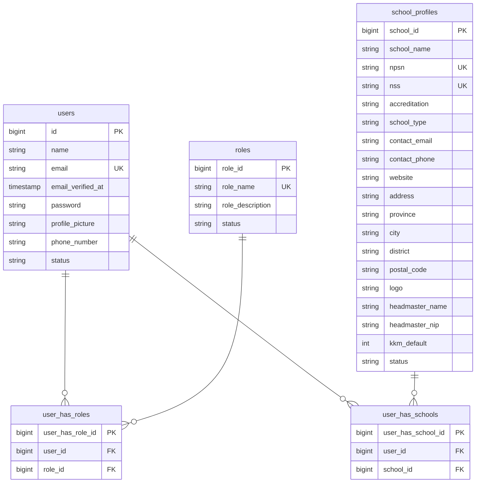

---

## 2. Academic — Tahun Ajaran, Semester, Mata Pelajaran, Kelas, Ruangan, Jadwal

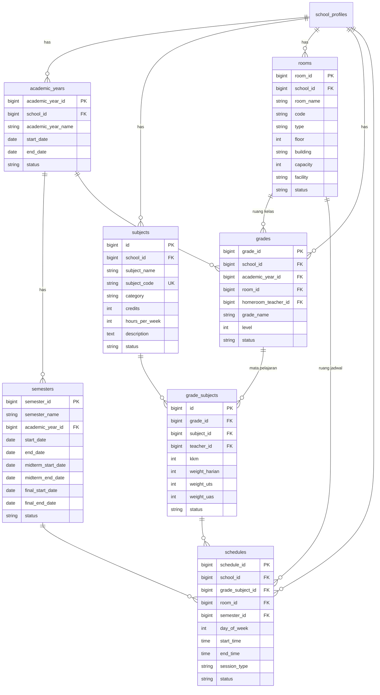

---

## 3. People — Guru, Siswa, Orang Tua

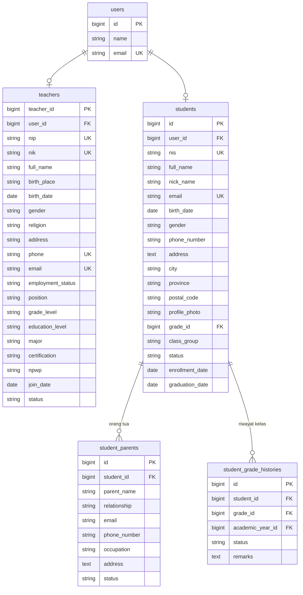

---

## 4. Absensi — Session & Detail

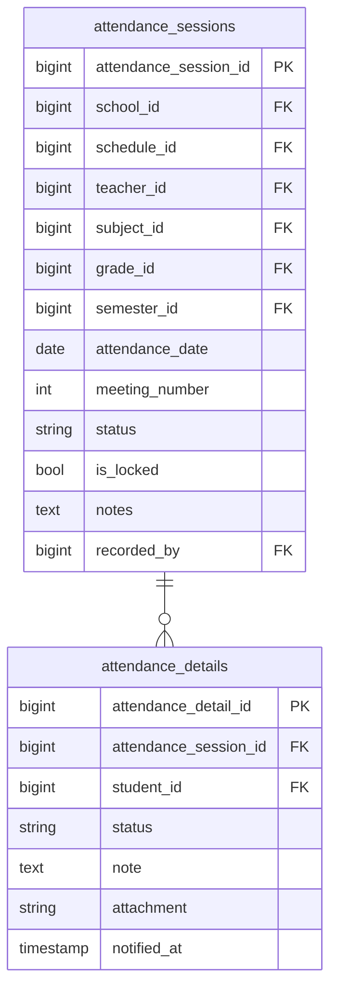

---

## 5. Penilaian — Sesi Nilai, Detail, Rapor

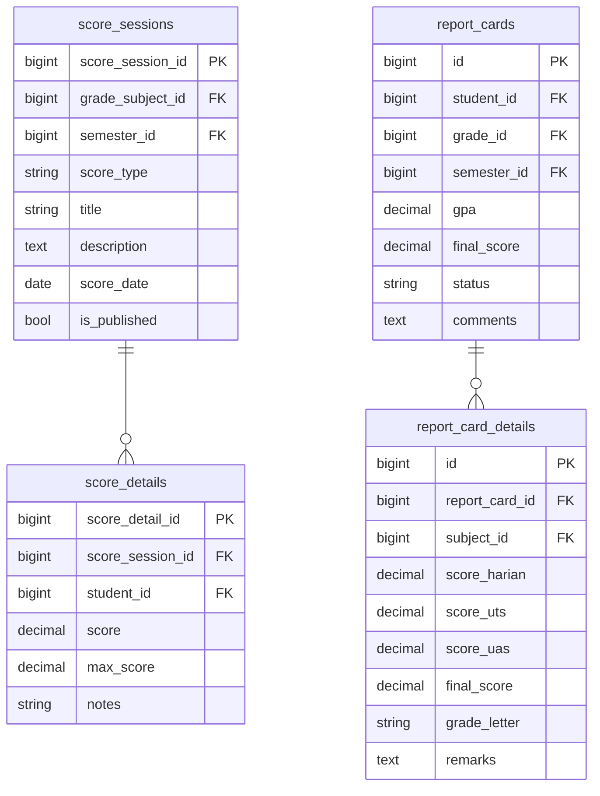

---

## 6. Ujian & Soal

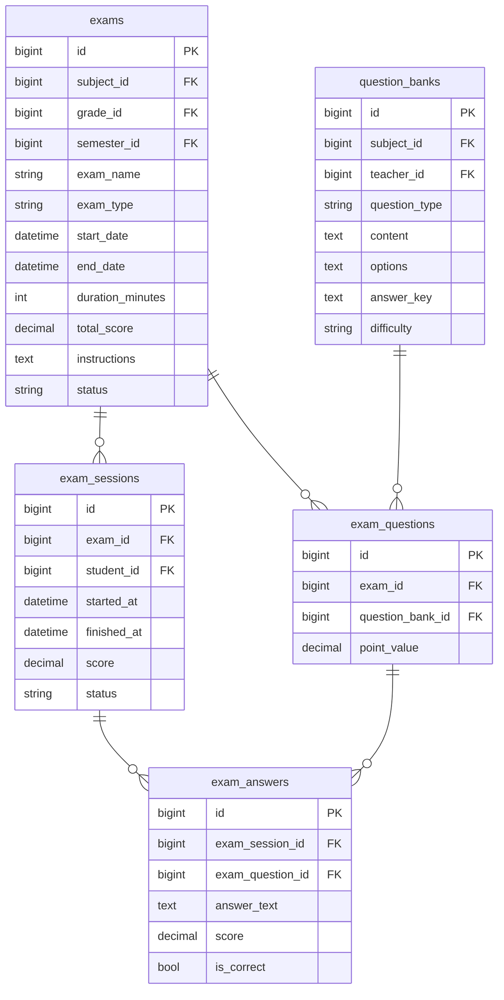

---

## 7. Tugas

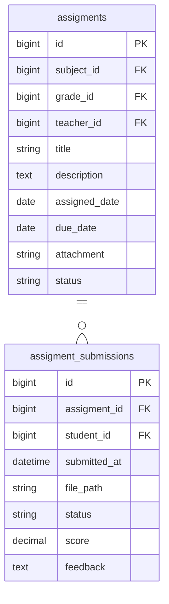

---

## 8. Keuangan

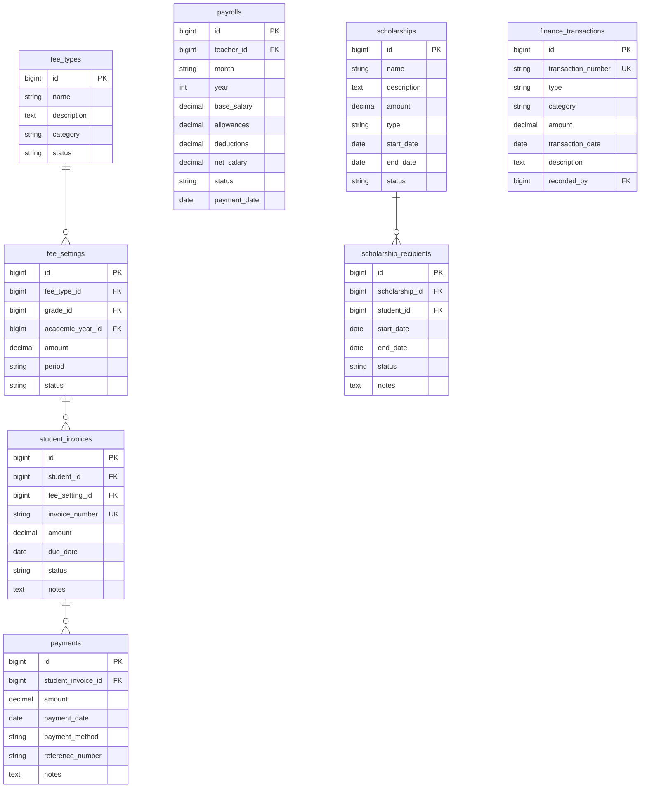

---

## 9. Perpustakaan

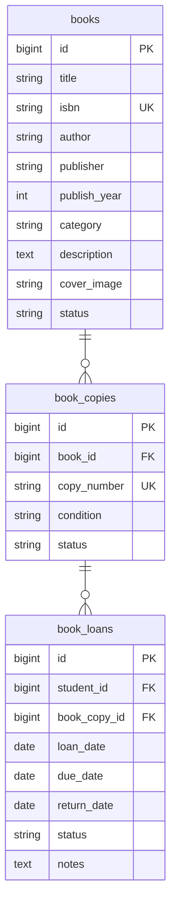

---

## 10. Aset

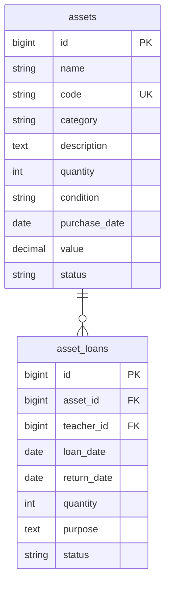

---

## 11. Komunikasi

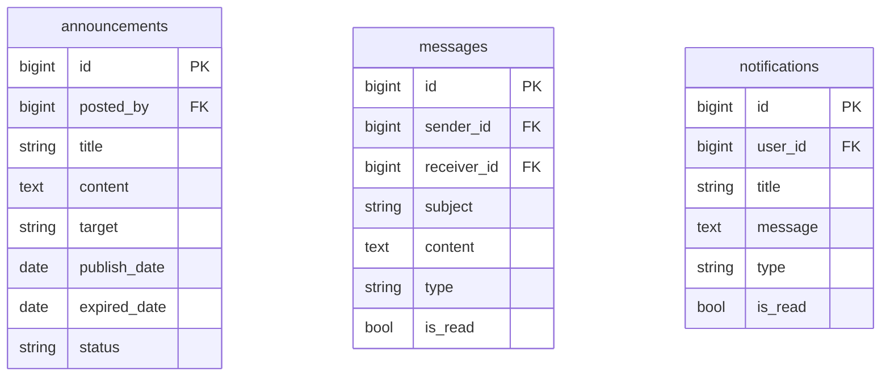

---

## 12. Aktivitas Tambahan

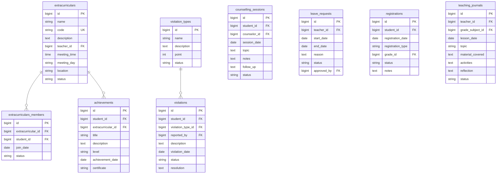

---

## 13. System

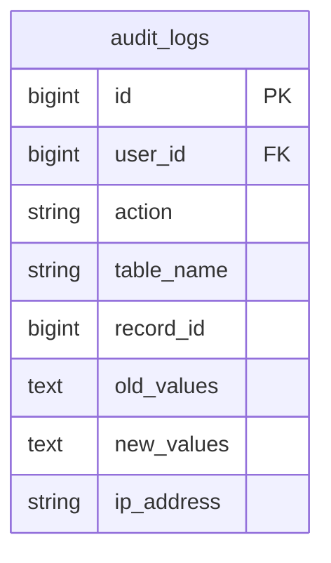

---

## Ringkasan Relasi Antar Domain

```
users ──┬── user_has_roles ──── roles
        ├── user_has_schools ── school_profiles ──┬── academic_years ── semesters
        │                                         ├── subjects
        │                                         ├── rooms
        │                                         ├── grades ──┬── grade_subjects ──┬── schedules
        │                                         │            │                    ├── score_sessions ── score_details
        │                                         │            │                    └── attendance_sessions ── attendance_details
        │                                         │            └── students ──┬── student_parents
        │                                         │                           ├── student_grade_histories
        │                                         │                           └── score_details
        ├── teachers ──┬── grade_subjects
        │              └── schedules
        └── students ──┬── score_details
                       ├── attendance_details
                       ├── exam_sessions ── exam_answers
                       ├── assigment_submissions
                       ├── book_loans
                       ├── student_invoices ── payments
                       ├── report_cards ── report_card_details
                       └── violations
```

---

## Legend

| Simbol | Arti |
|--------|------|
| `PK` | Primary Key |
| `FK` | Foreign Key |
| `UK` | Unique Key |
| `nullable` | Boleh NULL |
| `CASCADE` | Hapus record terkait jika parent dihapus |
| `SET NULL` | Set ke NULL jika parent dihapus |

---

## Total: 62 Tabel

| Domain | Tabel | Jumlah |
|--------|-------|--------|
| Core | users, roles, user_has_roles, user_has_schools, school_profiles, password_reset_tokens, sessions, cache, cache_locks, jobs, job_batches, failed_jobs | 12 |
| Academic | academic_years, semesters, subjects, rooms, grades, grade_subjects, schedules | 7 |
| People | teachers, students, student_parents, student_grade_histories | 4 |
| Activity | attendance_sessions, attendance_details, extracurriculars, extracurriculars_members, achievements, violation_types, violations, counselling_sessions, leave_requests, registrations, teaching_journals | 11 |
| Exam | score_sessions, score_details, report_cards, report_card_details, question_banks, exams, exam_questions, exam_sessions, exam_answers, assigments, assigment_submissions | 11 |
| Finance | fee_types, fee_settings, student_invoices, payments, payrolls, scholarships, scholarship_recipients, finance_transactions | 8 |
| Library | books, book_copies, book_loans | 3 |
| Asset | assets, asset_loans | 2 |
| Communication | announcements, messages, notifications | 3 |
| System | audit_logs | 1 |
| **Total** | | **62** |
